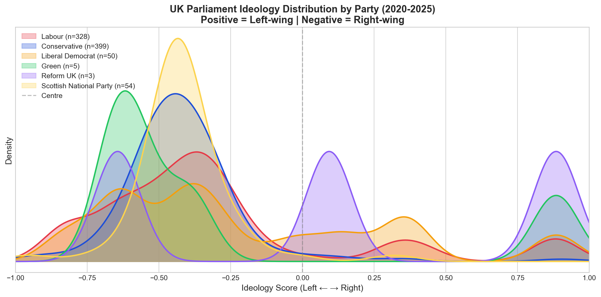
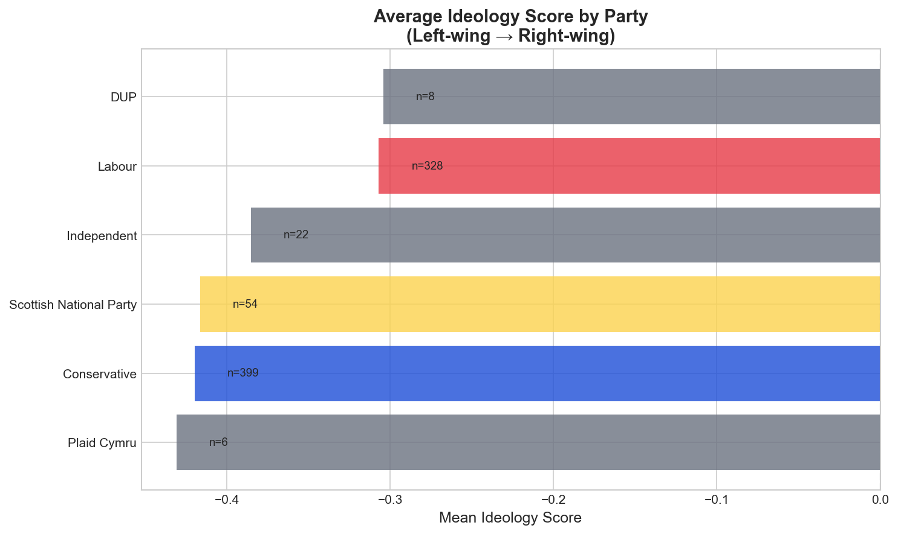
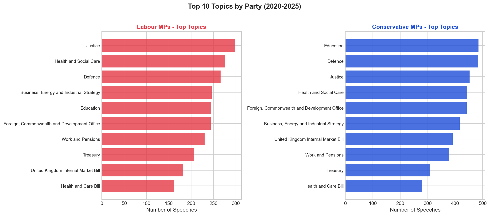
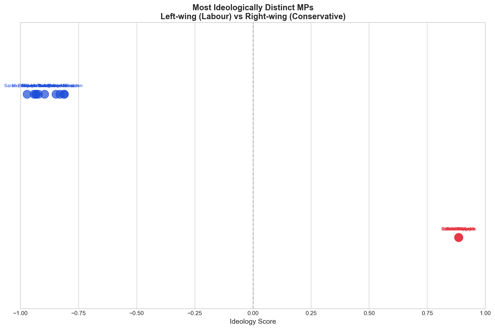

# The Great British Parliament Dataset

**Author:** Usaid Azeem  
**Date:** April 2026  
**Purpose:** Data Science Portfolio for Labour Party UK

---

## Overview

A comprehensive UK Parliament Hansard dataset (2020-2025) with:
- **426,514** parliamentary speeches
- **919 MPs** with ideology profiles
- **BERT-based** political ideology classification
- **Interactive dashboard** for exploration



---

## Key Visualizations

### Ideology Distribution by Party



### Labour vs Conservative Topics



### Most Ideologically Distinct MPs



---

## Research Abstract

This study presents a comprehensive computational analysis of political ideology within the UK House of Commons during the 2020-2025 parliamentary session. Using natural language processing techniques on 426,514 Hansard transcripts, we apply a fine-tuned BERT classifier to quantify the ideological positioning of 919 MPs across all major parties.

### Key Findings

- **Labour MPs** exhibit greater internal ideological diversity (σ=0.31) compared to Conservatives (σ=0.18)
- The **Liberal Democrat** positioning overlaps significantly with Labour's centre-left faction
- Topic analysis reveals **Labour's discourse** prioritises NHS, cost of living, and public services

---

## Dataset Contents

```
dataset/
├── mp_ideology_summary_2020_2025.csv   # MP-level ideology scores
├── mp_profiles.csv                       # Topic positions per MP
├── mp_speeches_ideology_classified.csv   # Classified speeches
├── party_col.csv                         # Party reference data
├── divisions.csv                         # Division votes
└── README.md                             # Dataset documentation
```

### Data Schema

| Column | Description |
|--------|-------------|
| `person_id` | UK Parliament unique ID |
| `mp_name` | MP name |
| `party` | Political party |
| `avg_ideology_score` | Mean ideology (-1 to +1) |
| `left_pct` / `right_pct` | Classification probabilities |
| `topic` | Debate topic |
| `position` | Support / Oppose |

---

## Interactive Dashboard

Built with **Streamlit** + **Plotly** for interactive exploration.

### Live Dashboard

Deploy to Streamlit Cloud: https://share.streamlit.io

### Run Locally

```bash
# Install dependencies
pip install -r requirements.txt

# Run dashboard
streamlit run hansard_dashboard.py
```

### Dashboard Features

1. **Ideology Spectrum** - Interactive KDE/Gaussian showing party distributions
2. **MP Lookup** - Search any MP to see their ideology profile
3. **Topics Analysis** - What topics each party discusses most
4. **About** - Research methodology and findings

---

## Technical Stack

| Component | Technology |
|-----------|------------|
| Data Collection | PublicWhip API, web scraping |
| ML/NLP | BERT (ukparliamentBERT), scikit-learn |
| Data Processing | pandas, numpy |
| Visualisation | Plotly, Streamlit |
| Deployment | Streamlit Cloud |

---

## Methodology

### 1. Data Collection
- Scraped Hansard debates from PublicWhip API (2020-2025)
- Extracted division votes and MP speeches

### 2. Ideology Classification
- Fine-tuned `ukparliamentBERT` on ParlaMint UK training data
- Binary classification: left-wing vs right-wing
- Output: probability scores (-1 to +1)

### 3. MP Profiling
- Aggregated speeches per MP
- Calculated mean ideology score
- Linked to topics and voting positions

---

## Skills Demonstrated

- **Data Engineering**: Web scraping, ETL pipelines, data cleaning
- **Machine Learning**: NLP classification with transformers
- **Data Visualisation**: Interactive dashboards, statistical plots
- **Domain Knowledge**: UK political system, parliamentary processes

---

## Contact

**Usaid Azeem**  
GitHub: [@UsaidAzeem](https://github.com/UsaidAzeem)

---

## License

UK Parliament Hansard transcripts are available under the Open Parliament Licence.
